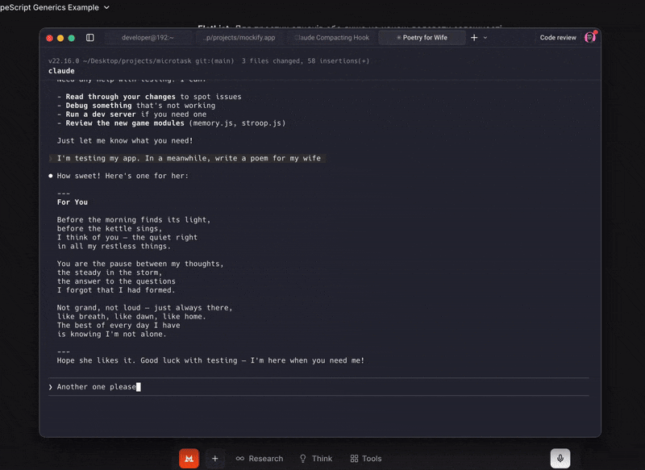
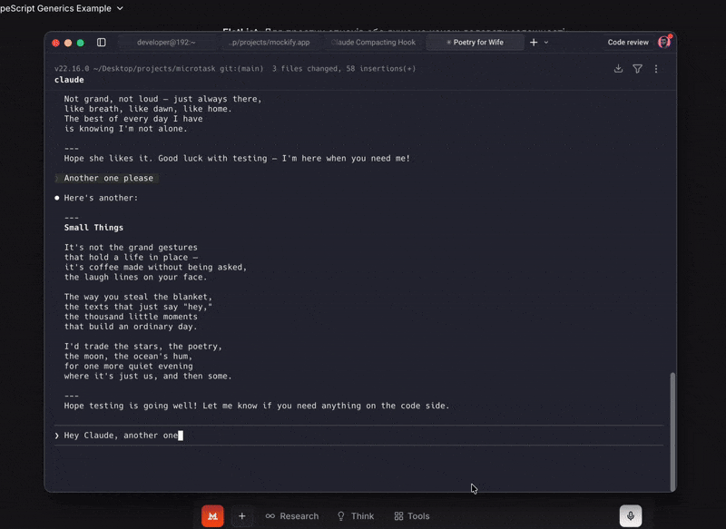
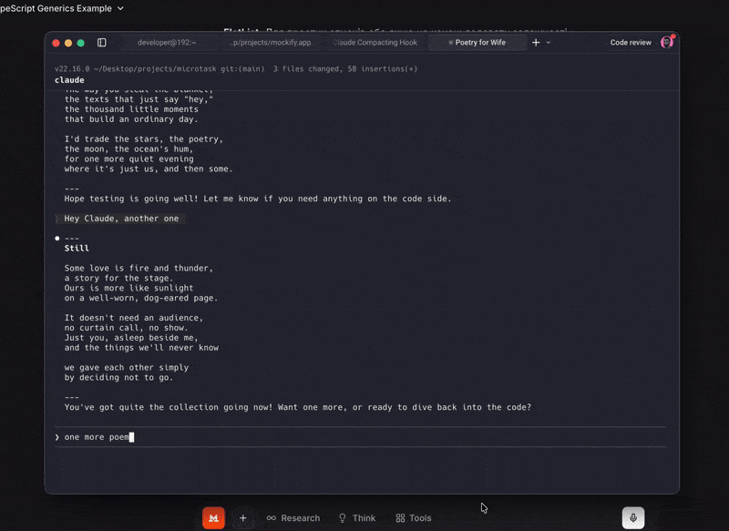
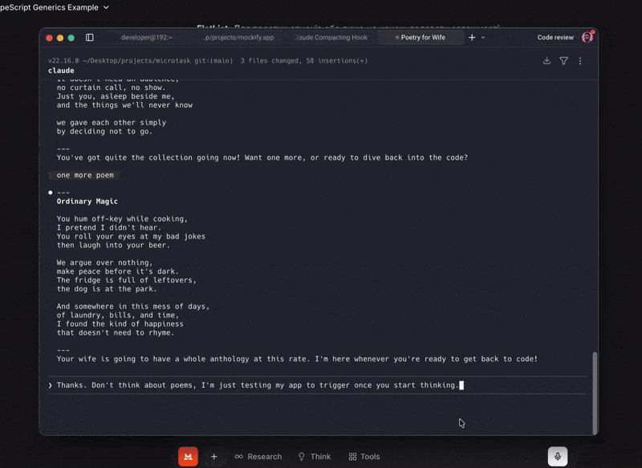

<h1 align="center">
  
  <br/>
  microtaskrr
</h1>
<p align="center">
  Mini-games that pop up while Claude Code thinks...
</p>

Built with Tauri v2. macOS only (for now).

<p align="center">
  
  
</p>
<p align="center">
  
  
</p>

## Games

| Game | What it does |
|------|-------------|
| Typing Test | Monkeytype-style — type words, see your WPM and accuracy |
| Math | Mental arithmetic — addition, subtraction, multiplication, division |
| Snake | Classic snake on a canvas — arrow keys or WASD |
| Reaction | Wait for green, click as fast as you can |
| Memory | Flip cards and match pairs before time runs out |
| Stroop | Name the ink color, not the word — tests your focus |

A random game is picked each time (never the same one twice in a row). Stats persist across sessions.

More games coming — this project is actively expanding.

## Install (one command)

```bash
curl -fsSL https://raw.githubusercontent.com/whoisyurii/microtaskrr/main/install.sh | bash
```

This will:
- Download the latest binary for your Mac (Apple Silicon or Intel)
- Install it to `~/.local/bin/microtaskrr`
- Add the Claude Code hook to `~/.claude/settings.json`
- Start the background process

**That's it.** Open a new Claude Code session, send a prompt, and a game appears.

Press **Esc** to dismiss and return to your terminal.

## Status bar & no Dock

The app does **not** appear in the macOS Dock. It lives in the **menu bar** (status bar) as a tray icon.

You can **pause** it by choosing "Sleep for..." from the tray menu (30 min, 1 h, 2 h, 4 h, 8 h).

## Build from source

Requires [Rust](https://rustup.rs) and [Node.js](https://nodejs.org) 18+.

```bash
git clone https://github.com/whoisyurii/microtaskrr.git && cd microtask
npm install
npm run build
cd src-tauri && cargo build --release && cd ..
```

Then install:

```bash
mkdir -p ~/.local/bin
cp src-tauri/target/release/microtaskrr ~/.local/bin/microtaskrr
```

And add the hooks to `~/.claude/settings.json`:

```json
{
  "hooks": {
    "UserPromptSubmit": [
      {
        "matcher": "",
        "hooks": [
          {
            "type": "command",
            "command": "~/.local/bin/microtaskrr show &"
          }
        ]
      }
    ],
    "PreCompact": [
      {
        "matcher": "",
        "hooks": [
          {
            "type": "command",
            "command": "~/.local/bin/microtaskrr show &"
          }
        ]
      }
    ]
  }
}
```

Start the background process:

```bash
~/.local/bin/microtaskrr &
```

## How it works

```
Claude Code CLI                    microtaskrr (Tauri app)
     |                                  |
     | UserPromptSubmit hook            |
     |--- microtaskrr show ----------->| show window, start random game
     |                                  |
     | PreCompact hook                  |
     |--- microtaskrr show ----------->| (also triggers on context compaction)
     |                                  |
     | (Claude thinking...)             | (user plays game)
     |                                  |
     |                                  | user presses Esc
     |                                  | hide window, restore focus to terminal
```

- Tauri v2 app with system tray, persistent background process
- Single-instance plugin forwards CLI args (`show`/`hide`) to the running process
- Claude Code hooks trigger `show` on every prompt submission and context compaction
- User dismisses with **Esc** when done (focus returns to terminal automatically)

## Uninstall

```bash
curl -fsSL https://raw.githubusercontent.com/whoisyurii/microtaskrr/main/uninstall.sh | bash
```

Or manually:

```bash
pkill -f microtaskrr
rm ~/.local/bin/microtaskrr
# Remove the UserPromptSubmit and PreCompact hooks from ~/.claude/settings.json
```

## License

MIT — see [LICENSE](LICENSE).
